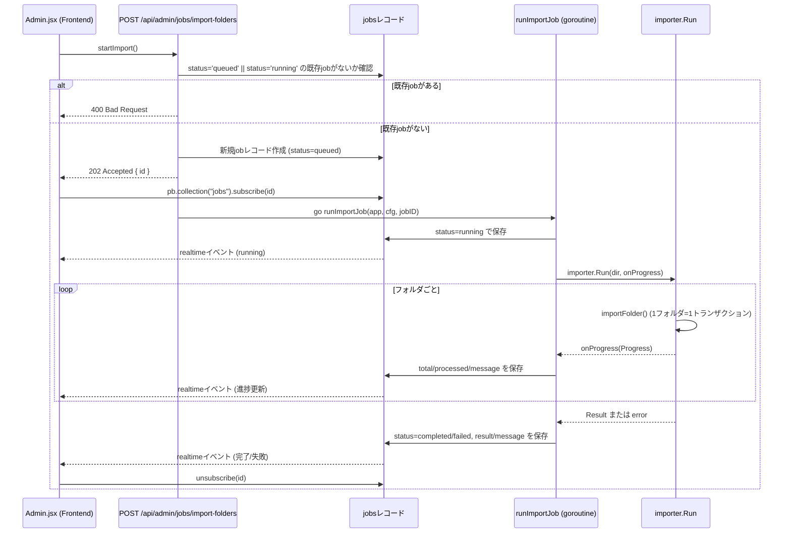
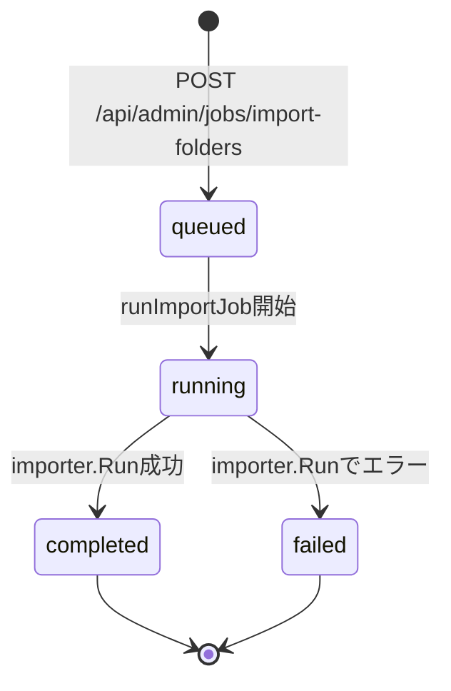
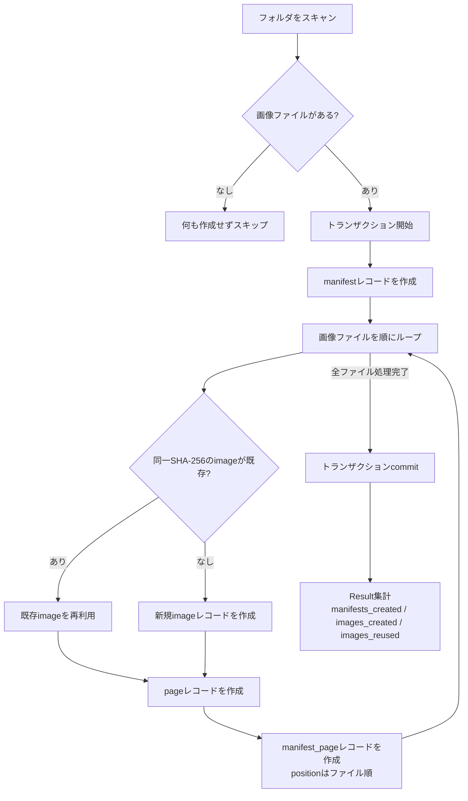

# Folioで管理するための画像資料をアップロード、または、スキャンする方法

将来的には、複数のファイル形式の変換機能も統合することが考えられるが、それは直交した機能なので、あらかじめ前処理した画像をインポートする機能から実装する

## インポートフォルダのスキャン

- インポートフォルダのパスは、FOLIO_IMPORT_DIR環境変数で指定する。
- ディレクトリの中には、本に相当するフォルダがあり、そのなかに、複数の画像が入っている構造を想定する。
- インポートの後は、`_done`のようなサブフォルダに移動する（開発中は移動すると面倒なので実装しない）

## 画像ファイルのDBへの登録
- 本のインポートは、1枚でも欠けていると問題なので、トランザクションで処理する。
- manifests, manifest_pages, pages, images にまたがるレコードをトランザクションで作成する必要がある。
- IMPORT_DIRのなかの画像がはいったフォルダの名前が、manifestのlabelになるようにし、その中のファイル名の順序にしたがって、manifest_pagesにおけるpositionを決定する必要がある。

# インポートジョブの非同期処理フロー

`FOLIO_IMPORT_DIR` 配下のフォルダをスキャンして `manifests` / `pages` / `images` 等のレコードを作成する「フォルダインポート」機能は、以下の3つの仕組みが組み合わさって動作する。

- バックエンドAPI (`internal/cmd/serve/serve.go`)
- インポート処理本体 (`internal/importer/importer.go`)
- PocketBaseのリアルタイム購読 (`frontend/src/routes/Settings/Admin.jsx`)

処理自体は同期的に終わらないため、`jobs` コレクションのレコードを進捗の置き場所として使い、フロントエンドはそのレコードをリアルタイム購読することで進捗・完了を検知する。ポーリングは行っていない。

## 登場人物

| 名前 | 実体 |
|---|---|
| UI | `Admin.jsx` の `startImport()` |
| API | `POST /api/admin/jobs/import-folders` (`importFoldersHandler`) |
| jobsレコード | 進捗・状態を保持する唯一の情報源 |
| goroutine | `runImportJob`（バックグラウンドで実行） |
| importer | `importer.Run` / `importFolder`（実際のDB書き込み） |

## シーケンス図

## ジョブステータスの状態遷移

フロントエンドは `status` が `completed` または `failed` になった時点で自分から `unsubscribe` して購読を終了する（`Admin.jsx`）。

## 1フォルダあたりの処理 (`importFolder`)

フォルダ1つ = マニフェスト1つ、という対応関係で、フォルダ内のすべてのレコード作成は単一トランザクションにまとめられている。途中で失敗した場合、そのフォルダ由来のレコードは一切残らない。

## 設計上のポイント

- **リアルタイム購読ベース**: `runImportJob` が `app.Save(job)` を呼ぶたびに、PocketBaseが自動でそのレコードの購読者へイベントを配信する。フロントエンド側もバックエンド側も、リアルタイム配信のために特別なコードを書く必要はない。
- **同時実行の防止**: `status = 'queued' || status = 'running'` のjobが1件でも存在する場合、APIは新規ジョブ受付を拒否する（400）。同時に2つのインポートが走ることはない。
- **フォルダ単位のアトミック性**: 1フォルダ = 1トランザクションなので、あるフォルダの途中でエラーが起きても、そのフォルダに関する中途半端なレコードは残らない。ただし複数フォルダをまたいだ全体としてのアトミック性はない（既に成功したフォルダのレコードはそのまま残る）。
- **画像の重複排除**: 画像はSHA-256ハッシュで既存レコードと照合され、同じ内容の画像は再利用される（`images_reused` としてカウント）。
- **再インポートは重複を許す**: 同じフォルダを再度インポートすると、`manifests` は既存の有無に関わらず新規に作成される（ラベルの重複チェックはしない）。重複排除されるのは画像バイナリのみ。